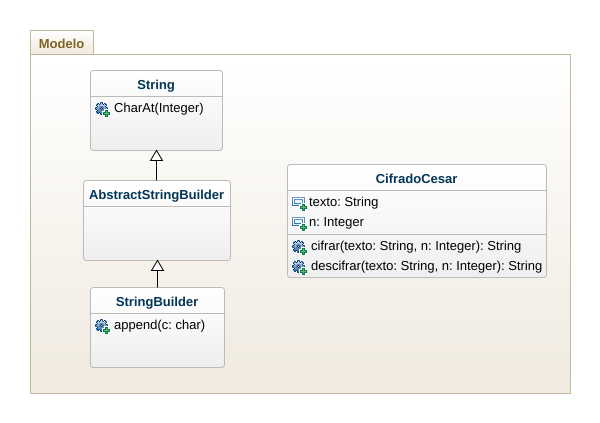

# César
La problemática radica en la seguridad de los mensajes y la necesidad de implementar privacidad ante el envió de ellos.

Diseñe, modelo e implemente un programa que genere seguridad al momento de enviar un mensaje. Este de una forma sencilla y asimétrica donde involucre el criptado César.

/// Programa Diseñado por: 

                           Daniel Florez                                ✈               ✈                  ✈

                           Lucas Nova

                           Johan S. Herrera M.                 ♨♨♨♨♨♨♨♨♨♨♨♨♨♨♨♨♨♨♨♨♨♨♨♨♨♨♨♨♨♨♨♨  ♛

## Diagrama de Clases

## vista

☹

 

©Copyright 2022
